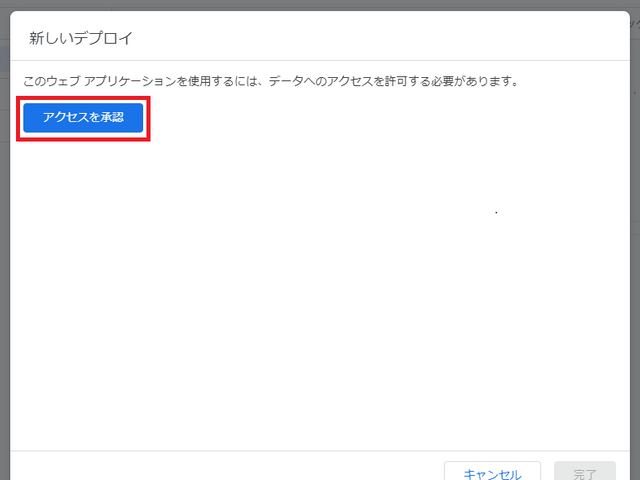

<!-- _class: lead -->
# M5 SAVE CSV DATA
# to GAS(Google Apps Script)

---
## GAS(Google Apps Script)とは？

Googleが提供するクラウドベースのスクリプト環境。Google Workspace（例: Google Sheets、Google Drive、Gmail）を自動化・拡張するために使用される。JavaScriptをベースにしており、簡単にスクリプトを作成して実行できる。

主な特徴
自動化: 定型作業を自動化（例: スプレッドシートのデータ処理）。
連携: Googleサービス間のデータ連携を簡単に実現。
無料: Googleアカウントがあれば誰でも利用可能。

---

「高度なブロック」から「HTTP」を選択
「HTTPリクエスト」追加して、メソッドを「POST」に設定。
データの＋マークを押して、KeyとValueを追加する。
関数として宣言しておくと便利。


---
次のプログラムを作ってみよう。URLはいったん空欄にしておく。


---
## GASの設定
Googleアカウントを用意し、スプレットシートを開く。
拡張機能からApps Scriptを選択


---
下記JavaScriptを書込み、右上の[デプロイ]->[新しいデプロイ]を選択

```JavaScript
function doPost(e) {
    console.log('catch post'); // POSTリクエストを受け取ったことをログに記録
    // スプレッドシートの特定のシートを取得
    let sheet = SpreadsheetApp.getActiveSpreadsheet().getSheetByName('sheetName');
  
    // POSTリクエストのデータをJSON形式で解析
    let params = JSON.parse(e.postData.getDataAsString());
    let id = params.id; // リクエストからリーダーIDを取得
    let data = params.data; // リクエストからタグ番号を取得
  
    // データをスプレッドシートに追加する処理
    let lock = LockService.getDocumentLock(); // 排他的処理のためのロックを取得
    if (lock.tryLock(5000)) { // 最大5秒間ロックを試行
      try {
        let datetime = new Date(); // 現在時刻を取得
        array = [[datetime, id, data]]; // 書き込むデータを2次元配列で準備
  
        sheet.insertRows(1, 1); // シートの1行目に新しい行を挿入
        sheet.getRange("A1:C1").setValues(array); // 1行目のA列からC列にデータを書き込む
        SpreadsheetApp.flush(); // スプレッドシートへの変更を即時反映
      } finally {
        lock.releaseLock(); // 処理が終わったらロックを解除
      }
    } else {
      console.log('ロックを取得できませんでした'); // ロックが取得できなかった場合のログ
    }
  }

```

---
下記画面が表示されたら、設定⚙️からウェブアプリを選択。


---
アクセスできるユーザーを「全員」に設定し、デプロイをクリック。


---
「アクセスを承認」をクリックし、表示された自分のアカウントをクリックする。
<div style="display: flex; justify-content: center; gap: 10px;">
  
  
</div>

---
赤矢印のプロジェクト名をクリックし、最後に「Arrow」をクリックする。
<div style="display: flex; justify-content: center; gap: 10px;">
  
  
</div>

---
これでデプロイが完了し、GASのプログラムが動く様になる。ウェブアプリのURLはM5用に使用するのでコピーする。


---
M5のプログラムに戻り、HTTP POST処理のURLにコピーしたGASのURLを貼り付ける。


---
M5のCボタンを押すと、idと現在のカウントをPOSTする。POSTが成功すると画面が緑になり、失敗すると赤になる。スプレットシートにデータが入力されているのが確認できる。A列には、GAS側で日時を追加する様に設定したので、POSTされた日時が自動で追加される。


---
<!-- _class: lead -->
## Next Step!

- センサーユニットのデータをGASにポストしてみよう！
- 複数台のM5で同時にデータをポストしてみよう！(idを分ける)